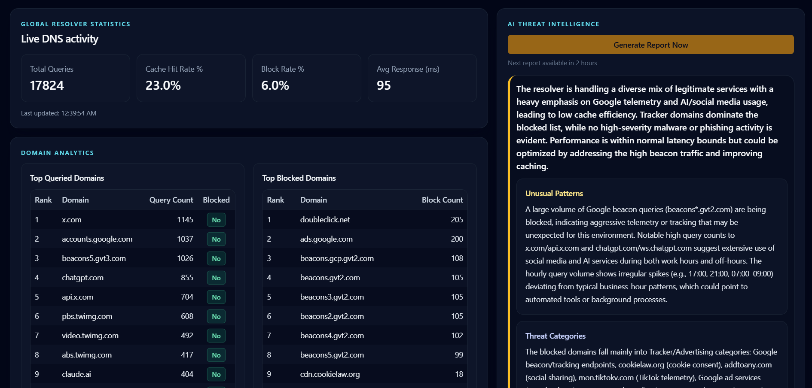

# DoH Resolver

A self-hostable **DNS-over-HTTPS (DoH) resolver** with Redis caching, malicious domain blocking, PostgreSQL query logging and an AI-powered threat intelligence dashboard..

Built as a privacy-preserving DNS proxy — your ISP sees only encrypted HTTPS traffic, and upstream resolvers like Cloudflare see only the server's IP, never yours.



## Live Demo

| Service | URL |
|---|---|
| Resolver | `https://dns.namansingh.dev/dns-query` |
| Dashboard | `https://doh-resolver.vercel.app/login` |
| Dashboard Password | `admin123` |

---

## Features

- **DNS-over-HTTPS** — resolves DNS queries over HTTPS (RFC 8484), encrypting traffic from your ISP
- **Privacy Proxy** — upstream resolvers see only the server IP, never the originating client
- **Redis TTL Caching** — caches responses with TTL matching the DNS record, reducing upstream lookups by ~X%
- **Blocklist Protection** — ingests Steven Black's unified hosts list (100k+ malicious domains) into a Redis Set with O(1) lookup at resolution time
- **PostgreSQL Query Logging** — logs every query with domain, type, cache hit, blocked status, and response time
- **AI Threat Intelligence** — daily analysis of resolver telemetry via DigitalOcean GenAI (`gpt-oss-120b`), surfacing threat categories, unusual patterns, and performance insights
- **Analytics Dashboard** — Next.js admin panel showing live stats, top queried domains, top blocked domains, and AI-generated reports
- **Single-command Deploy** — self-hostable on any VPS with PM2 + Nginx

---

## Architecture

```
Client Device
    │
    │ HTTPS (port 443)
    ▼
Nginx (reverse proxy + SSL termination)
    │
    │ HTTP (port 3001, internal)
    ▼
Node.js Resolver (Express)
    │
    ├──► Redis (Upstash)
    │     ├── Blocklist Set (100k+ domains, O(1) lookup)
    │     └── DNS Response Cache (TTL-matched)
    │
    ├──► PostgreSQL (Neon)
    │     └── Query logs (domain, type, cache hit, blocked, latency)
    │
    └──► Cloudflare 1.1.1.1 (upstream, cache miss only)
          └── Sees server IP only, never client IP

Dashboard (Vercel)
    └──► PostgreSQL (Neon) — reads query logs + threat intel reports
    └──► DigitalOcean GenAI — generates threat intelligence reports
```

---

## Privacy Model

| Threat | Protection |
|---|---|
| ISP logging your DNS queries | Queries wrapped in HTTPS — ISP sees only encrypted traffic |
| Upstream resolver seeing your IP | Resolver acts as proxy — Cloudflare sees server IP only |
| Malware/tracker domains loading | Blocked at resolution time via Redis blocklist |
| Dashboard exposed publicly | Protected behind HTTP-only encrypted session cookie |

> **Note:** DoH improves privacy meaningfully but is not full anonymity. ISPs can still infer some destinations via IP connections and TLS SNI after DNS resolution.

---

## Performance

| Metric | Value |
|---|---|
| Cache hit response time | ~X ms (P99) |
| Upstream resolution time | ~X ms (P99) |
| Blocklist lookup | O(1) via Redis Set |
| Blocklist size | 100,000+ domains |
| Requests/sec (stress tested) | X,000+ |

---

## Tech Stack

| Layer | Technology |
|---|---|
| Runtime | Node.js + TypeScript |
| Framework | Express.js |
| Cache + Blocklist | Redis (Upstash) |
| Database | PostgreSQL (Neon) + Prisma |
| Dashboard | Next.js + TailwindCSS + Shadcn UI |
| AI | DigitalOcean GenAI (`gpt-oss-120b`) |
| Auth | iron-session (HTTP-only encrypted cookies) |
| Reverse Proxy | Nginx + Let's Encrypt SSL |
| Process Manager | PM2 |
| Hosting | DigitalOcean Droplet (resolver) + Vercel (dashboard) |

---

## Self-Hosting

### Prerequisites
- A VPS (DigitalOcean, AWS, etc.) with Ubuntu 22.04+
- A domain name
- [Upstash](https://upstash.com) Redis instance (free tier)
- [Neon](https://neon.tech) PostgreSQL instance (free tier)

### 1. Clone the repo

```bash
git clone https://github.com/YOUR-USERNAME/doh-resolver.git
cd doh-resolver/resolver
npm install
```

### 2. Configure environment variables

```bash
cp .env.example .env
nano .env
```

```env
DATABASE_URL=your-neon-connection-string
UPSTASH_REDIS_URL=your-upstash-url
UPSTASH_REDIS_TOKEN=your-upstash-token
PORT=3001
```

### 3. Build and start

```bash
npm run build
pm2 start src/server.js --name doh-resolver
pm2 startup
pm2 save
```

### 4. Configure Nginx

```nginx
server {
    listen 443 ssl;
    server_name dns.yourdomain.com;

    location / {
        proxy_pass http://localhost:3001;
        proxy_http_version 1.1;
        proxy_set_header Host $host;
        proxy_set_header X-Real-IP $remote_addr;
        proxy_set_header X-Forwarded-For $proxy_add_x_forwarded_for;
        proxy_set_header X-Forwarded-Proto $scheme;
    }
}
```

```bash
certbot --nginx -d dns.yourdomain.com
```

### 5. Configure your browser

| Browser | Setting |
|---|---|
| Chrome / Brave | Settings → Privacy → Security → Use Secure DNS → Custom → `https://dns.yourdomain.com/dns-query` |
| Firefox | Settings → Privacy → DNS over HTTPS → Custom → same URL |
| Android | Private DNS → `dns.yourdomain.com` |

---

## Dashboard Setup

```bash
cd ../dashboard
npm install
cp .env.example .env
```

```env
DASHBOARD_PASSWORD=your-password
DATABASE_URL=your-neon-connection-string
SESSION_SECRET=your-32-char-secret
DO_GENAI_API_KEY=your-digitalocean-genai-key   # optional
```

Deploy to Vercel:

```bash
vercel deploy
```

---

## Project Structure

```
doh-resolver/
├── resolver/                  # Node.js + Express DNS server
│   ├── src/
│   │   ├── server.ts          # Main resolver + route handlers
│   │   └── ingester.ts        # Blocklist ingestion
│   ├── prisma/
│   │   └── schema.prisma
│   └── package.json
│
└── dashboard/                 # Next.js admin panel
    ├── app/
    │   ├── login/             # Auth page
    │   ├── dashboard/         # Main stats page
    │   └── api/               # Server actions (AI report generation)
    ├── prisma/
    │   └── schema.prisma
    └── package.json
```

---

## How it Works

### Query Resolution Flow

```
1. Query arrives at POST/GET /dns-query
2. Domain extracted and normalized to lowercase
3. Redis SET lookup → if blocked, return NXDOMAIN (0.0.0.0)
4. Redis GET lookup → if cached, return cached response
5. Forward to Cloudflare 1.1.1.1 as upstream
6. Cache response with TTL from DNS record
7. Log query to PostgreSQL asynchronously
8. Return response to client
```

### AI Threat Intelligence Flow

```
1. Manual trigger via dashboard or daily cron at midnight
2. Query PostgreSQL for last 24hrs: top 100 domains, top 50 blocked, hourly volume
3. Send summary to DigitalOcean GenAI (gpt-oss-120b)
4. Parse structured JSON response
5. Store report in ThreatIntelligence table
6. Display on dashboard with: summary, unusual patterns, threat categories, performance notes
```

### Blocklist Ingestion Flow

```
1. On server startup, fetch Steven Black unified hosts list
2. Parse ~100k+ malicious domains
3. Load into Redis Set (SADD) in batches
4. Daily cron refreshes the list at midnight
5. Each DNS query checks blocklist with SISMEMBER — O(1)
```

---

## Screenshots

### Dashboard — Live Stats + AI Threat Intelligence


### Dashboard — Domain Analytics


---

## Environment Variables

### Resolver (`resolver/.env`)

| Variable | Required | Description |
|---|---|---|
| `DATABASE_URL` | Yes | Neon PostgreSQL connection string |
| `UPSTASH_REDIS_URL` | Yes | Upstash Redis URL |
| `UPSTASH_REDIS_TOKEN` | Yes | Upstash Redis token |
| `PORT` | No | Server port (default: 3001) |
| `UPSTREAM_DNS` | No | Upstream resolver (default: Cloudflare) |

### Dashboard (`dashboard/.env`)

| Variable | Required | Description |
|---|---|---|
| `DATABASE_URL` | Yes | Neon PostgreSQL connection string |
| `DASHBOARD_PASSWORD` | Yes | Admin dashboard password |
| `SESSION_SECRET` | Yes | 32+ char secret for iron-session |
| `DO_GENAI_API_KEY` | No | DigitalOcean GenAI key for AI reports |
| `DATADOG_API_KEY` | No | Datadog API key (Pro features) |
| `DATADOG_APP_KEY` | No | Datadog application key |

---

## Acknowledgements

- [Steven Black's Hosts List](https://github.com/StevenBlack/hosts) — unified malicious domain blocklist
- [Cloudflare 1.1.1.1](https://1.1.1.1) — upstream DNS resolver
- [DigitalOcean GenAI](https://www.digitalocean.com/products/gen-ai) — AI threat intelligence
